# CatBot

네오아두보드를 이용한 캣봇 단계별 코딩

먼저, Catbot은 버전이 1과 2로 나뉘어져 있습니다.

**현재 페이지에 있는 소스는 Version 2.0** 입니다.

버전이 나뉘어지는 방식은 아래와 같습니다.

조향장치 부분인 앞 부분의 모양이 이와 같다면 **VERSION1**입니다.

### Version 1.0

[CODE Version1.0](https://github.com/Neo3ds/ArduinoCatbot/releases/tag/version1.0)

버전 1.0이시라면 해당 링크를 이용하셔서 zip파일들을 다운 받아 진행해주세요.

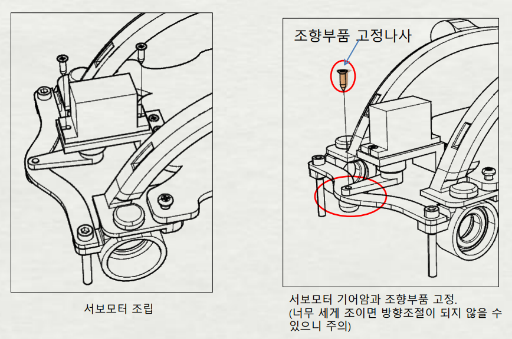

## Android App

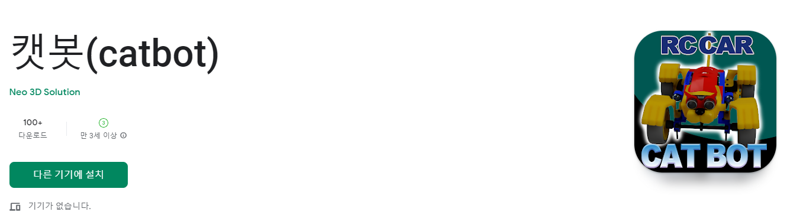

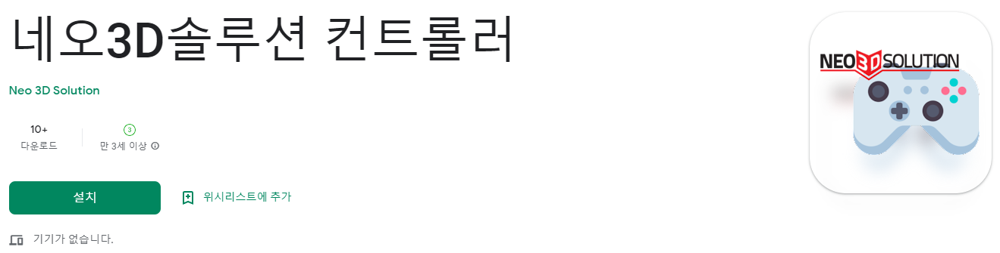

## MBlock5

### 1. LED

|  색상  | 핀번호  |
| :--: | :--: |
|  빨강  |  D9  |
|  초록  | D10  |
|  파랑  | D11  |

#### - 01. Blink LED

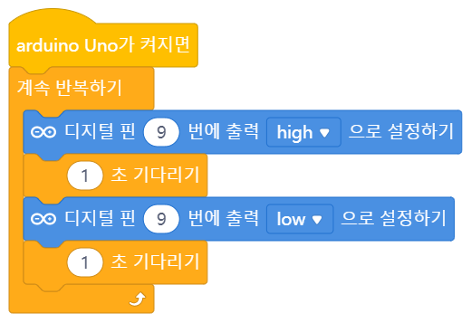

#### - 02. 점점 밝아지는 LED

#### - 03. 점점 밝았다가 어두워지는 반복 LED

02번의 내용에 점점 어두워지는 부분을 추가하여 진행하기만 하면 됩니다.

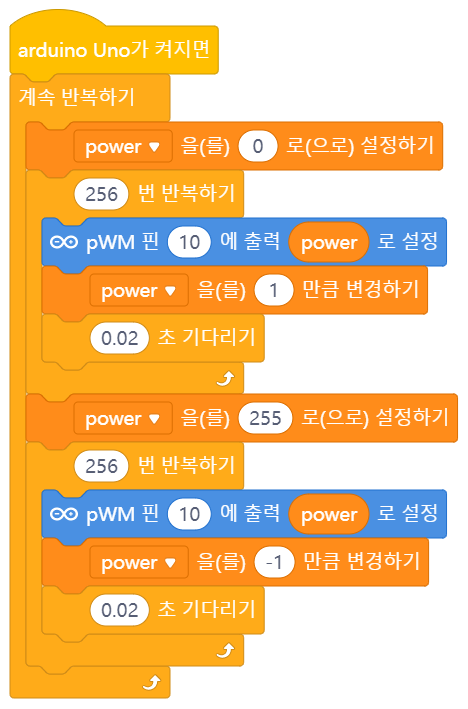

(시간복잡도를 최소화해서 작성하는 방식은 기재하지 않았습니다.)

### 2. Buzzer

|  부저   | 핀번호  |
| :---: | :--: |
| 수동 부저 |  D3  |

네오아두보드에서는 수동부저를 사용하고 있으며, 수동 부저는 멜로디를 낼 수 있습니다.

#### - 01. Siren

LED와 부저를 이용하여 경찰차 사이렌을 실습해보도록 하겠습니다.

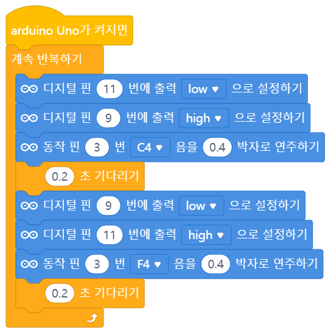

### 3. Servo

| 서보 모터 | 핀번호  |
| :---: | :--: |
| SG90  |  D9  |

서보 모터는 `0~180`도를 움직일 수 있는 서보 모터를 사용하였습니다.

네오아두보드에서 D9번은 LED 빨강과 연결되어 있으면서도 서보를 사용하면 동시에 물리게 됩니다.

다른 번호를 통해서 제어할 수도 있으나, 같은 핀을 사용하게 되면 서보 모터를 제어할 때 빨강 LED 색상이 나오게 됩니다.

그리고 서보 모터를 끼운 상태에서 빨강 LED에 색상을 주어도 서보 모터가 움직이게 되니

이점을 유의해서 코드를 작성해주셔야 합니다.

#### - 01. 참참참 게임 만들기

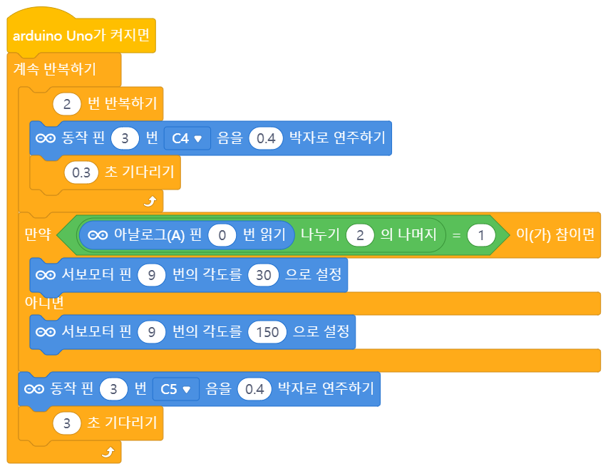

### 4. 초음파 센서

| Ultrasonic | 핀번호  |
| :--------: | :--: |
|    TRIG    | D12  |
|    ECHO    | D13  |

`HC-SR04`의 경우에는 2cm 간격이 필요합니다. 이는 초음파를 보내고 받아야하기 때문입니다.

#### - 01. 15cm 이내 LED ON / 밖이면 OFF

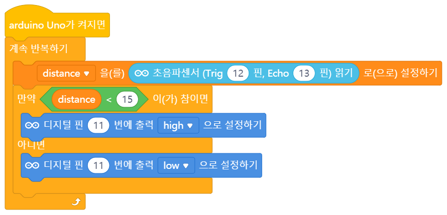

블록형 코딩에서 단위는 기본적으로 `cm`입니다.

### 5. 블루투스 2.0

| HC-06 | 핀번호  |
| :---: | :--: |
|  TX   |  A4  |
|  RX   |  A5  |

`HC-06`은 블루투스 2.0 버전을 사용하고 있습니다.

블루투스 2버전은 아이폰에서는 잡을 수가 없습니다.

2버전을 사용하는 이유는 다루기 쉬워서 입니다.

4버전으로 가게 되면 `BLE 통신`을 주로 사용하게 되는데 해당 방식은 초급자에게 어려움이 있습니다.

먼저, 블루투스 기능을 사용하기 위해서는 `확장` 기능을 사용해야  합니다.

확장 블록에서 `네오아두보드`를 검색하여 추가해주세요.

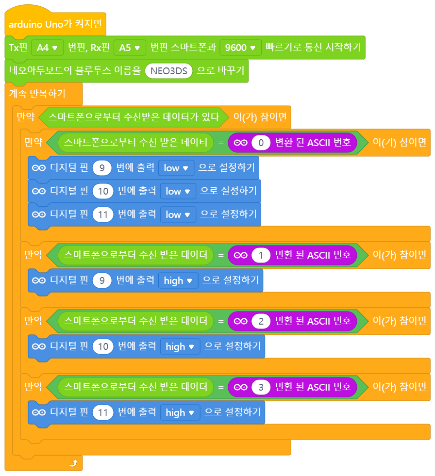

### 6. millis()

기다리기는 `delay()`를 쓰는 방식인데 해당 방식을 쓰면 보드 자체가 멈추게 됩니다.

즉, 센서의 값을 지속적으로 읽으면서 delay를 주게 되면 그 센서값도 그 시간만큼 못읽게 된다는 말입니다.

예를 들어, 블루투스 통신을 한다고 하였는데 10초 정도 기다리게 하면 10초 통안 블루투스 명령이 먹히지 않게 됩니다.

이러한 방식을 막기 위해서 `millis()` :point_right: `타이머` 블록을 사용하여 보드가 켜진지 얼마나 시간이 지났는가를 통해 해결할 수 있습니다.

이 부분은 로직 구현으로 회피하는 방식입니다. 코드를 어떻게 작성하는가에 따라 효율적일 수 있고 아니면 delay같이 될수도 있습니다.

#### - 01. LED Millis

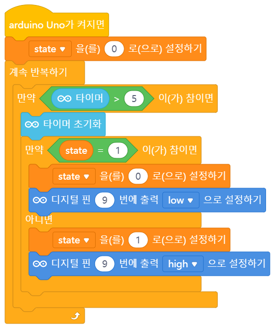

5초간 LED가 켜지고, 5초간 LED가 꺼지는 것을 반복하는 코드입니다.

`만약~O1~아니면~O2~` O1부분과 O2부분에 어떠한 수행문장을 넣어서 진행할 수 있기에 간단하게 짜는 것보다 이게 여러 동작을 동시에 줄수도 있습니다.

### 7. Final

| Motor Driver | 핀번호  |
| :----------- | :--: |
| 오른쪽FW        |  D2  |
| 오른쪽BW        |  D4  |
| 오른쪽 속도제어 핀   |  D5  |
| 왼쪽 속도제어 핀    |  D6  |
| 왼쪽FW         |  D7  |
| 왼쪽BW         |  D8  |

#### - 01. 움직이는 RC카

먼저, 간단하게 움직이는 RC카를 만들어 보도록 하겠습니다.

함수를 이용하지 않고 블록을 짰기에 블록이 깁니다.

함수를 이용하면 간단하게 할 수 있습니다. (해당 부분 생략)

:rotating_light:현재 블록은 Version 1.0이며 Version 2.0과 Servo motor의 각도만 변경되었습니다.

`L` 160도 / `R` 20도

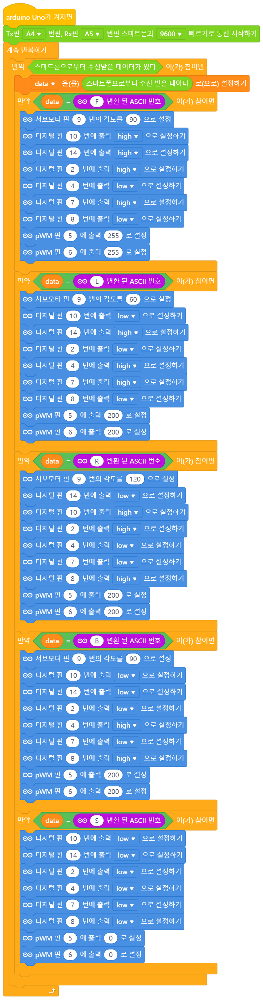

